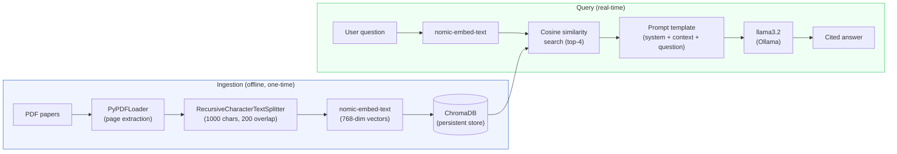

# Ask My Research — RAG over peer-reviewed publications

A Retrieval-Augmented Generation app that lets users ask natural language questions about my peer-reviewed research papers and receive cited, grounded answers.

Built with LangChain, ChromaDB, Ollama, and Streamlit. Also deployed as a **live API** powering a chat widget on my [portfolio site](https://rejusamjohn.pages.dev).

## Architecture



### How it works

1. **Ingestion** — PDFs are loaded page-by-page, split into overlapping chunks, embedded into 768-dimensional vectors using `nomic-embed-text`, and stored in ChromaDB on disk.

2. **Retrieval** — A user's question is embedded with the same model. ChromaDB finds the 4 most semantically similar chunks via cosine similarity.

3. **Generation** — The retrieved chunks are injected as context into a prompt template. The LLM (`llama3.2`) generates an answer grounded in the actual paper text, citing sources.

## Papers included

| Paper | Topic | Journal |
|-------|-------|---------|
| John et al. (2024) | High connectivity limits impact of travel time on disease transmission | J. R. Soc. Interface |
| John et al. (2024) | Modelling Lassa virus dynamics in West African *Mastomys natalensis* | J. R. Soc. Interface |
| Muylaert et al. (2022) | Present and future distribution of bat hosts of sarbecoviruses | Nature Communications |
| Hayman et al. (2022) | Ebola virus persistence in non-human primate populations is unlikely | J. R. Soc. Interface |
| Rulli et al. (2021) | Coronavirus spillover risk hotspots | — |
| Reju et al. (2025) | Land use change and infectious disease emergence | Reviews of Geophysics |

## Quick start

```bash
# Environment
uv venv && source .venv/bin/activate
uv pip install -r requirements.txt

# Models (requires Ollama)
ollama pull llama3.2
ollama pull nomic-embed-text

# Ingest papers (one-time)
python -m src.ingest

# Launch the app
PYTHONPATH=. streamlit run src/app.py
```

## Project structure

```
├── api.py                  # FastAPI backend for website chat widget
├── src/
│   ├── config.py           # Centralised parameters (chunk size, models, paths)
│   ├── ingest.py           # PDF loading → chunking → embedding → ChromaDB
│   ├── retriever.py        # Vector similarity search over stored chunks
│   ├── chain.py            # LCEL chain: retrieve → prompt → LLM → parse
│   └── app.py              # Streamlit chat interface with source display
├── scripts/
│   └── ingest_deploy.py    # Ingestion with sentence-transformers (for deployment)
├── tests/
│   ├── test_ingest.py      # Unit tests for loading and chunking logic
│   └── test_chain.py       # Unit tests for prompt formatting and template
├── requirements.txt        # Local development dependencies (Ollama)
├── requirements-api.txt    # API deployment dependencies (Groq, FastAPI)
├── Procfile                # Render start command
└── render.yaml             # Render deployment config
```

## Live deployment (API + website chat widget)

The app is also deployed as a REST API that powers a chat widget embedded in my [portfolio website](https://rejusamjohn.pages.dev). This uses a different stack from the local Streamlit app to run without Ollama.

### Deployment architecture

| Component | Local (Streamlit) | Deployed (API) |
|-----------|-------------------|----------------|
| Embeddings | `nomic-embed-text` via Ollama | `all-MiniLM-L6-v2` via sentence-transformers |
| LLM | `llama3.2` via Ollama | `llama-3.3-70b-versatile` via Groq (free tier) |
| Vector store | `chroma_db/` | `chroma_db_deploy/` |
| Interface | Streamlit chat UI | FastAPI → website JS fetch |
| Hosting | localhost | Render (free tier) |

### How I deployed it

**Step 1 — Create the deploy vector store**

The deployed API uses `sentence-transformers/all-MiniLM-L6-v2` instead of Ollama for embeddings, so a separate vector store is needed:

```bash
uv pip install -r requirements-api.txt
python scripts/ingest_deploy.py
# Creates chroma_db_deploy/ with sentence-transformers embeddings
```

**Step 2 — Test the API locally**

```bash
GROQ_API_KEY=xxx uvicorn api:app --reload --port 8000

# Test
curl -X POST http://localhost:8000/ask \
  -H "Content-Type: application/json" \
  -d '{"question": "How does Lassa virus transmit?"}'
```

The API supports multiple LLM providers via env vars:

| Provider | Env var | Model | Cost |
|----------|---------|-------|------|
| Groq (default) | `GROQ_API_KEY` | llama-3.3-70b-versatile | Free (1K req/day) |
| OpenAI | `OPENAI_API_KEY` + `LLM_PROVIDER=openai` | gpt-4o-mini | ~$0.01/100 queries |
| Google Gemini | `GOOGLE_API_KEY` + `LLM_PROVIDER=gemini` | gemini-2.0-flash | Free tier (region-dependent) |

**Step 3 — Deploy to Render**

1. Push repo to GitHub (include `chroma_db_deploy/`)
2. Connect repo on [render.com](https://render.com) → New Web Service
3. Set environment variable: `GROQ_API_KEY`
4. Render uses `render.yaml` and `Procfile` automatically

**Step 4 — Wire up the website**

The portfolio site (`rejusamjohn.pages.dev`) has a chat widget in the hero section. The JS sends `POST /ask` requests to the Render API URL. Update `RAG_API_URL` in the website's `script.js` to point to the deployed Render URL.

## Adding new publications

When you add new PDFs to `data/papers/`:

```bash
# 1. Re-ingest for local Streamlit app (requires Ollama running)
python -m src.ingest

# 2. Re-ingest for deployed API
python scripts/ingest_deploy.py

# 3. Test locally
GROQ_API_KEY=xxx uvicorn api:app --reload --port 8000
# Ask a question about the new paper to verify retrieval

# 4. Push to GitHub — Render will auto-redeploy
git add data/papers/new_paper.pdf chroma_db_deploy/
git commit -m "Add [paper name] to knowledge base"
git push
```

## Design decisions

| Decision | Choice | Rationale |
|----------|--------|-----------|
| Chunk size | 1000 chars / 200 overlap | Balances context retention with retrieval precision for dense academic text |
| Embedding model | `nomic-embed-text` (768-dim) | Runs locally via Ollama, no API costs, strong performance on semantic search benchmarks |
| Vector store | ChromaDB (persistent) | Lightweight, no server needed, good enough for ~1000 chunks |
| LLM | `llama3.2` via Ollama | Fully local inference, no API keys, good instruction-following |
| Temperature | 0.1 | Near-deterministic for factual, citation-grounded answers |
| Retrieval | Top-4 similarity search | Enough for cross-paper synthesis without diluting context |
| Chunking strategy | `RecursiveCharacterTextSplitter` | Splits on paragraph → sentence → word boundaries, keeping text coherent |
| Deploy embeddings | `all-MiniLM-L6-v2` (384-dim) | Runs on CPU without Ollama, small footprint (~90MB), widely supported |
| Deploy LLM | Groq `llama-3.3-70b-versatile` | Free tier (1K req/day), fastest inference provider, 70B quality |
| API framework | FastAPI | Async-ready, auto-generated docs, CORS built-in, lightweight |

## Example

**Q:** *What did you find about Ebola persistence in primates?*

**A:** Transmission models suggest that Ebola virus infection cannot be maintained in ape populations, even with repeated introductions. The analysis found that EVD infection results in small to medium-sized clusters of cases with high case fatality and very low seropositive animals in the population. [Source: transmission-models-indicate-ebola-virus-persistence-in-non-human-primate-populations-is-unlikely]

## Limitations and future improvements

- **Semantic gap on method-specific queries** — Questions about "methods" don't always retrieve the Methods section because the embedding of a general question diverges from technical methodology text. A query expansion or HyDE (Hypothetical Document Embeddings) step would help.
- **Cross-paper contamination** — Pure similarity search can pull chunks from loosely related papers. MMR (Maximal Marginal Relevance) or metadata filtering by paper would improve precision.
- **No re-ranking** — Adding a cross-encoder re-ranker (e.g., `ms-marco-MiniLM`) after initial retrieval would improve the ordering of results.
- **Section-aware chunking** — Current chunking is position-based. Detecting section headers (Abstract, Methods, Results, Discussion) and chunking within sections would preserve more structure.

## Running tests

```bash
PYTHONPATH=. pytest tests/ -v
```

## Tech stack

- **LangChain** — pipeline orchestration (LCEL)
- **ChromaDB** — vector storage and similarity search
- **Ollama** — local LLM and embedding model inference
- **Streamlit** — web UI
- **PyPDF** — PDF text extraction
- **pytest** — unit testing
- **FastAPI** — REST API for deployed chat widget
- **sentence-transformers** — deployment embeddings (no Ollama dependency)
- **Groq** — free LLM inference (llama-3.3-70b-versatile)
- **Render** — cloud hosting for the API
