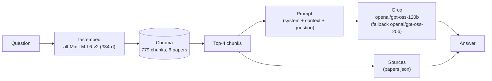

# Ask My Research — RAG over peer-reviewed publications

A Retrieval-Augmented Generation service that answers natural-language questions about my peer-reviewed research papers, with answers grounded in and cited from the papers themselves. It runs as a REST API that powers the "Ask My Research" chat widget on my [portfolio site](https://rejusamjohn.pages.dev).

## Architecture



The question is embedded with the same model used at ingest time (`fastembed`, running `all-MiniLM-L6-v2` as ONNX, no PyTorch or GPU required). Chroma returns the 4 most similar chunks by cosine similarity. Those chunks are formatted into a prompt and sent to Groq. If the primary model fails or times out, the request retries once against the fallback model before the API gives up. Sources returned to the caller are looked up from `papers.json` using the chunks that were actually retrieved, not parsed out of the model's answer, so a paper can only be cited if it was genuinely part of the context.

## API

### `POST /ask`

Request:

```json
{"question": "How does Lassa virus spread to humans?"}
```

Response (200):

```json
{
  "answer": "Lassa virus is primarily transmitted to humans through contact with urine or faeces of infected Mastomys natalensis rats...",
  "sources": [
    {
      "title": "Modelling Lassa virus dynamics in West African Mastomys natalensis and the impact of human activities",
      "authors_short": "John et al.",
      "year": 2024,
      "journal": "Journal of The Royal Society Interface",
      "doi": "10.1098/rsif.2024.0106"
    }
  ]
}
```

Error responses:

| Status | Body | When |
|---|---|---|
| 422 | `{"error": "invalid_question"}` | Question is missing, not a string, or outside 3–500 characters after trimming |
| 429 | `{"error": "rate_limited"}` | Caller has exceeded the per-client rate limit |
| 503 | `{"error": "unavailable"}` | Pipeline isn't ready yet, or both the primary and fallback model calls failed |
| 500 | `{"error": "unavailable"}` | Unhandled server error |

Every response, success or error, carries an `X-Request-ID` header for tracing a single call through the logs.

### `GET /health`

Returns `200 {"status": "ok"}` once the retrieval pipeline has loaded, or `503 {"status": "starting"}` before that (used as Render's health check).

## Configuration

Read from environment variables (see `.env.example`):

| Variable | Default | Notes |
|---|---|---|
| `GROQ_API_KEY` | — | Required. No default; the API refuses to start without it |
| `GROQ_MODEL` | `openai/gpt-oss-120b` | Primary generation model |
| `GROQ_FALLBACK_MODEL` | `openai/gpt-oss-20b` | Used if the primary model call fails or times out |
| `LLM_TIMEOUT_S` | `30` | Timeout per model call, in seconds; one retry is attempted on failure |
| `RATE_LIMIT_PER_MIN` | `10` | Requests allowed per client per minute (fixed window, keyed by client IP) |
| `ALLOWED_ORIGINS` | production site + local dev origins | Comma-separated list of CORS origins allowed to call `/ask` |

## Running locally

```bash
cp .env.example .env
# then fill in GROQ_API_KEY in .env

uv venv
uv pip install -r requirements-dev.txt
.venv/bin/uvicorn api:app --reload --port 8000
```

## Tests

```bash
.venv/bin/pytest              # offline: no network calls, no API key needed
.venv/bin/pytest -m live -v -s  # calls the real Groq API; needs a valid .env
```

## Evaluation

```bash
.venv/bin/python -m eval.run_eval          # retrieval hit rate only, no API key needed
.venv/bin/python -m eval.run_eval --live   # also generates live answers for manual review
```

Both write to [`eval/results.md`](eval/results.md), which lists retrieval hit rate per question, along with sample answers to a set of in-scope and deliberately out-of-scope questions.

## Deployment

The API is deployed on Render's free tier, configured by `render.yaml`. `GROQ_API_KEY` is set in the Render dashboard rather than in `render.yaml` since it's a secret; `GROQ_MODEL` and `GROQ_FALLBACK_MODEL` are set from `render.yaml` but can be overridden in the dashboard. The health check path is `/health`.

Render's free tier spins the instance down after around 15 minutes of inactivity. The first request after that takes roughly 30–60 seconds while the instance wakes up and the pipeline reloads; the website's chat widget shows a "waking up" message during that window rather than failing silently.

## Updating dependencies

Runtime and dev dependencies are pinned in `requirements-api.txt` and `requirements-dev.txt`, compiled from the corresponding `.in` files:

```bash
uv pip compile requirements-api.in --python-version 3.11 -o requirements-api.txt
uv pip compile requirements-dev.in --python-version 3.11 -o requirements-dev.txt
```

## Local-only variant

`src/` holds the original version of this project: a Streamlit chat app running entirely on local models via Ollama (`llama3.2` for generation, `nomic-embed-text` for embeddings). It's kept for offline experimentation and isn't part of the deployed API.

## Licence

MIT.
