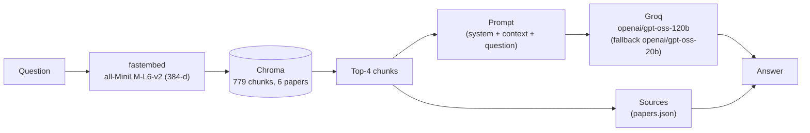

# Ask My Research — RAG over peer-reviewed publications

A Retrieval-Augmented Generation service that answers natural-language questions about my peer-reviewed research papers, with answers grounded in and cited from the papers themselves. The live "Ask My Research" chat widget on my [portfolio site](https://rejusamjohn.pages.dev) is served by the Cloudflare Worker in `worker/` (see "Cloudflare Worker" below); this Python API is the prototype it grew from, and it stays in the repo for local experimentation.

## Architecture


```mermaid
flowchart LR
    Q["Question"] --> E["fastembed\nall-MiniLM-L6-v2 (384-d)"]
    E --> C[("Chroma\n779 chunks, 6 papers")]
    C --> K["Top-4 chunks"]
    K --> P["Prompt\n(system + context + question)"]
    P --> G["Groq\nopenai/gpt-oss-120b\n(fallback openai/gpt-oss-20b)"]
    G --> A["Answer"]
    K --> S["Sources\n(papers.json)"]
    S --> A
```

The question is embedded with the same model used at ingest time (`fastembed`, running `all-MiniLM-L6-v2` as ONNX, no PyTorch or GPU required). Chroma returns the 4 most similar chunks by cosine similarity. Those chunks are formatted into a prompt and sent to Groq. If the primary model times out or hits a temporary error, that call is retried once; if it still fails, or the error is permanent (such as "model not found"), the request goes straight to the fallback model, which gets the same treatment before the API gives up. When both fail, the status returned reflects the fallback model's failure. Sources returned to the caller are looked up from `papers.json` using the chunks that were actually retrieved, not parsed out of the model's answer, so a paper can only be cited if it was genuinely part of the context.

## API

### `POST /ask`

Request:

```json
{"question": "How does Lassa virus spread to humans?"}
```

Response (200):

```json
{
  "answer": "Lassa virus is primarily transmitted to humans through contact with urine or faeces of infected Mastomys natalensis rats...",
  "sources": [
    {
      "title": "Modelling Lassa virus dynamics in West African Mastomys natalensis and the impact of human activities",
      "authors_short": "John et al.",
      "year": 2024,
      "journal": "Journal of The Royal Society Interface",
      "doi": "10.1098/rsif.2024.0106"
    }
  ],
  "status": "answered"
}
```

`status` is `"answered"`, `"partial"` or `"none"`, read from a `STATUS:` line the model is prompted to put first and which never reaches the caller as text. `"partial"` means the papers only cover part of the question; `"none"` means they don't answer it at all, and `answer` then falls back to a fixed line rather than whatever the model wrote. This is a Worker-only addition: the FastAPI app below doesn't set it.

Error responses:

| Status | Body | When |
|---|---|---|
| 422 | `{"error": "invalid_question"}` | Question is missing, not a string, or outside 3–500 characters after trimming |
| 429 | `{"error": "rate_limited"}` | Caller has exceeded the per-client rate limit, or both models failed and the fallback's failure was a Groq rate limit |
| 503 | `{"error": "unavailable"}` | Pipeline isn't ready yet, or both the primary and fallback model calls failed for any other reason |
| 500 | `{"error": "unavailable"}` | Unhandled server error |

Every response, success or error, carries an `X-Request-ID` header for tracing a single call through the logs.

### `GET /health`

Returns `200 {"status": "ok"}` once the retrieval pipeline has loaded, or `503 {"status": "starting"}` before that (used as Render's health check).

## Configuration

Read from environment variables (see `.env.example`):

| Variable | Default | Notes |
|---|---|---|
| `GROQ_API_KEY` | — | Required. No default; the API refuses to start without it |
| `GROQ_MODEL` | `openai/gpt-oss-120b` | Primary generation model |
| `GROQ_FALLBACK_MODEL` | `openai/gpt-oss-20b` | Used if the primary model call fails or times out |
| `LLM_TIMEOUT_S` | `20` | Timeout per model call, in seconds; a timeout or temporary error is retried once |
| `RATE_LIMIT_PER_MIN` | `10` | Requests allowed per client per minute (fixed window, keyed by client IP) |
| `ALLOWED_ORIGINS` | production site + local dev origins | Comma-separated list of CORS origins allowed to call `/ask` |

## Running locally

```bash
cp .env.example .env
# then fill in GROQ_API_KEY in .env

uv venv
uv pip install -r requirements-dev.txt
.venv/bin/uvicorn api:app --reload --port 8000
```

## Tests

```bash
.venv/bin/pytest              # offline: no network calls, no API key needed
.venv/bin/pytest -m live -v -s  # calls the real Groq API; needs a valid .env
```

## Evaluation

```bash
.venv/bin/python -m eval.run_eval          # retrieval hit rate only, no API key needed
.venv/bin/python -m eval.run_eval --live   # also generates live answers for manual review
```

Both write to [`eval/results.md`](eval/results.md), which lists retrieval hit rate per question, along with sample answers to a set of in-scope and deliberately out-of-scope questions.

## Deployment (Render, standby)

The Python API above still runs on Render's free tier, configured by `render.yaml`, kept as a standby until the Worker has been running cleanly for about a week. `GROQ_API_KEY` is set in the Render dashboard rather than in `render.yaml` since it's a secret; `GROQ_MODEL` and `GROQ_FALLBACK_MODEL` are set in `render.yaml`, so change them there. The health check path is `/health`.

Render's free tier spins the instance down after around 15 minutes of inactivity. The first request after that takes roughly 30–60 seconds while the instance wakes up and the pipeline reloads; the website's chat widget shows a "waking up" message during that window rather than failing silently.

## Cloudflare Worker (production)

The chat widget runs on a Cloudflare Worker, on Cloudflare's edge instead of a free-tier VM that spins down. `worker/` holds this rewrite in TypeScript, with the same `/ask` contract as the FastAPI app plus the `status` field described above.

**What runs where:**

- The Worker (`worker/src/index.ts`) serves `POST /ask`.
- Chunk embeddings live in a Vectorize index called `research-chunks`, queried with Workers AI's `@cf/baai/bge-small-en-v1.5` model (384 dimensions) — replacing Chroma's role.
- Both model calls (Groq primary, Workers AI fallback) go through an AI Gateway named `ask-my-research`, which adds caching, rate limiting and request logging.
- Groq (`openai/gpt-oss-120b`) is still the primary generation model. The fallback, if Groq fails, is a Workers AI-hosted model rather than a second Groq model, so the chat keeps answering even if Groq itself is unavailable.

**Local development:**

```bash
cd worker
npx wrangler dev
```

Serves the Worker at `http://127.0.0.1:8787`. Local runs still need a Groq key: create `worker/.dev.vars` (git-ignored) with:

```
GROQ_API_KEY=
```

**Tests:**

```bash
cd worker
npx vitest run
```

**Re-ingesting the chunks:**

The Worker doesn't read Chroma directly. Chunk text and embeddings are exported once and pushed to Vectorize; re-run this whenever the source chunks change:

```bash
cd ~/Projects/rag-publications
.venv/bin/python -m scripts.export_chunks     # chroma_db_deploy -> worker/data/chunks.jsonl

cd worker
CLOUDFLARE_ACCOUNT_ID=... CLOUDFLARE_API_TOKEN=... node scripts/ingest.ts   # -> worker/data/vectors.ndjson (needs Node 22.18+)
npx wrangler vectorize insert research-chunks --file=data/vectors.ndjson
```

`worker/data/` holds exported paper text, so — like the PDFs — it's git-ignored and never committed.

**Comparing Render and the Worker:**

Before pointing the site at the Worker, `worker/scripts/parity.ts` runs the questions in `eval/questions.json` against both services and prints a Markdown table comparing status, latency, whether the expected paper was retrieved, citation counts, and any citation for a paper outside `papers.json`:

```bash
cd worker
node scripts/parity.ts https://rag-publications-api.onrender.com https://ask-my-research.<subdomain>.workers.dev
```

It pauses 7 seconds between calls to stay under both services' rate limits.

**Free-tier budget:**

Everything below sits comfortably inside Cloudflare's free plan; nothing needs a paid add-on.

| Resource | Free tier | This project's usage | Guard |
|---|---|---|---|
| Workers | 100,000 requests/day, 10 ms CPU per request | A personal chat widget sees a handful of requests a day | CPU time excludes network waits (the Vectorize query and the model calls); the citation filter has its own timing test to stay well inside the limit |
| Vectorize | 5,000,000 stored dimensions, 30,000,000 queried dimensions/month | 779 chunks × 384 dimensions ≈ 299,000 stored; roughly 400,000 queried per 1,000 questions | Fixed six-paper corpus, so stored dimensions don't grow between re-ingests |
| Workers AI | 10,000 neurons/day | A full re-ingest costs roughly 360 neurons (779 chunks × ~250 tokens ≈ 0.2M tokens × 1,841 neurons/M); embeddings at query time cost next to nothing, and only a fallback answer (~100 neurons) draws on the same budget | Fallback only, used when Groq fails; exhausting the daily allowance maps to `503 unavailable` rather than a paid overage |
| Groq | Free-tier daily request caps | Small — a personal site's day-to-day traffic | A `429` from Groq falls back to Workers AI; if that also fails, the caller gets `503 unavailable` |
| AI Gateway | Free (logging, caching, rate limiting) | Fronts every Groq and Workers AI call | Exact-match answer cache for a day, plus a gateway-level rate limit as a second fence behind the Worker's own limiter |
| Web Analytics | Free | Beacon on the main site's pages | — |

**After cutover:** the FastAPI app in this repo stays only for local experimentation (see "Running locally" above); the Render service itself will be suspended once the Worker has run cleanly for about a week, so it stops consuming free-tier hours it no longer needs.

## Updating dependencies

Runtime and dev dependencies are pinned in `requirements-api.txt` and `requirements-dev.txt`, compiled from the corresponding `.in` files:

```bash
uv pip compile requirements-api.in --python-version 3.11 -o requirements-api.txt
uv pip compile requirements-dev.in --python-version 3.11 -o requirements-dev.txt
```

## Local-only variant

`src/` holds the original version of this project: a Streamlit chat app running entirely on local models via Ollama (`llama3.2` for generation, `nomic-embed-text` for embeddings). It's kept for offline experimentation and isn't part of the deployed API.

## Licence

MIT.
